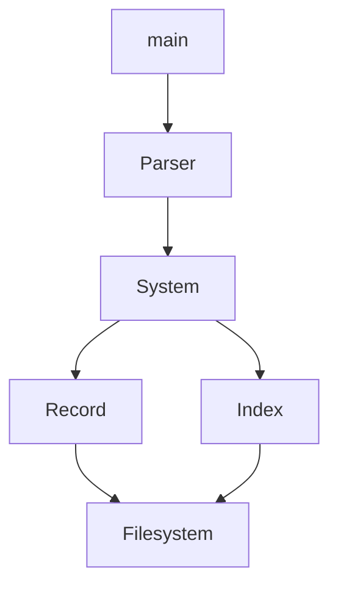
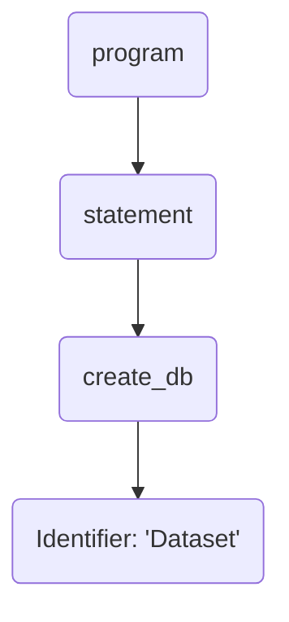

# 项目总结报告

## 系统架构设计

各模块及其依赖关系如下如所示：



- `main()` 作为程序入口，负责提供 CLI 交互功能，将用户输入的查询语句交由 `Parser` 模块进行语法分析
- `Parser` 根据 SQL 文法构造出抽象语法树，从而根据不同功能分别调用 `System` 的方法
- `System` 模块提供数据库的各种核心功能，包括数据库、表、记录、schema 的增删改查等
- `Record` 模块在 `Filesystem` 的基础上提供对记录的操作
- `Index` 模块在 `Filesystem` 的基础上提供基于文件的 B+ 树索引
- `Filesystem` 为课程提供的页式文件系统

---

采用 CMake 进行项目构建，除 `main` 之外的模块都分别按照依赖关系进行链接、编译为静态库

## 各模块详细设计

### main

通过循环实现 CLI 交互界面，引入 GNU Readline 实现左右移动光标、行内编辑、输入历史等功能，优化输入体验

### parser

#### antlr

- 根据提供的 SQL 语法，调用 `antlr` 的 `.jar` 文件生成 `C++` 代码
- 生成的代码中有 visitor 虚类，编写 `MyVisitor` 类继承虚类
- 除此之外还需要 `antlr` runtime，下载源码后编译为库文件，配置 CMake 添加依赖

#### MyVistor

模块对外提供 `parse()` 函数，输入为 `main()` 函数获得的字符串，`parse()` 函数会调用 `antlr` 进行词法、语法分析，得到抽象语法树后，用 `MyVistor` 进行遍历，在其中调用 `system` 的接口，实现相应功能

例如用户输入语句 `CREATE DATABASE Dataset;`，`main()` 以将该字符串为参数调用 `parse()`，`antlr` 会建立如下抽象语法树：

`MyVisitor` 在访问到 `create_db` 时，先将其所有子节点访问完毕，将所有参数获取完毕后，调用 `system` 中 `DBManager` 的 `create_db()` 方法

### system

对外提供 `DBManager` 类，相当于实验文档中的查询解析和系统管理模块

#### 查询解析

处理记录的增删改查操作

首先检查由parser得到的表名、列名、WHERE条件等信息的合法性，对于查询操作根据WHERE条件检索表内的索引，若有可用的索引则用索引迭代器查询记录，否则用记录迭代器查询全部记录，对于连接查询操作用 `vector` 对每个表记录迭代器，支持任意数量表的连接。查询操作的结果会存放在`Query`类中，提供`to_str()`输出，或者用`to_value()`等接口进行嵌套查询。

#### 系统管理

##### 数据库

- 数据库的所有文件都存储在相对于终端工作路径的 `databases/` 目录中，每个数据库对应其内的一个文件夹。

    - 例如 `CREATE DATABASE Dataset;` 将会在 `databases/` 创建 `Dataset` 文件夹。

- `DBManager` 维护了一个 `string` 变量 `current_dbname`，用来记录 `USE` 语句使用的数据库，该名称也会出现在 CLI 的提示中
    - 程序刚进入时 `current_dbname` 为空，其为空时显示为 `MercuryDB`；只有此时才可以 DROP 数据库，所以如果当前在其他数据库需要先 `USE MercuryDB;`

##### schema

- 每张表对应数据库文件夹内的一个子文件夹，其中存储 `.data` 数据文件、`.index` 索引文件以及 `.schema` 文件
- 模块内实现了 `Schema` 类，存储表名、表的各列结构信息、主外键、索引等信息。每当创建表或 ALTER 语句更改了 schema 时，`DBManager` 会将 `Schema` 对象序列化，存储至 `.schema` 文件
- 同时 `DBManager` 内部维护了表名到 `Schema` 对象的 Hashmap，当 `USE` 一个数据库时会从硬盘中读取该数据库中所有表的 `.schema` 文件，反序列化为 `Schema` 对象，存储至 Hashmap 中，便于查询时快速取用
- 由于可能有多个外键，创建外键时若用户未指定外键名，`DBManager` 将以 `${TABLE_NAME}_fk${0, 1, 2, ...}` 的形式对其进行命名


### record

在页式文件系统的基础上实现了分页的记录存取改等功能。

实现了变长记录的存取，每个表对应一个文件，在创建和打开文件时需要上层模块提供表的基本元数据，包括定长数据（int和float类型）个数和变长数据（varchar类型）个数。

每条记录依次存储NULL位图、定长数据（4字节）、变长数据（2字节长度+变长数据）。

页面布局大致为：从前往后依次存放每条记录，从后往前依次存储每个槽的偏移量和标识位（是否为空，是否为最后一个槽）

支持基于迭代器模式遍历表内所有数据，提供迭代器和int之间的转换便于建立索引

### index

在页式文件系统的基础上实现了B+树索引，每个索引对应一个文件，每个B+树节点对应一个页

支持多键值的联合索引，在创建和打开索引时由上层模块提供键值个数

页面布局大致为：页头记录节点信息（是否叶子、孩子数量等），之后存放键值和索引值/子节点页号等数据

提供基于迭代器模式的B+树查找、遍历功能

### filesystem


## 主要接口说明

### system

- `string create_db(string &name)`
- `string drop_db(string &name)`
- `string show_dbs()`
- `string use_db(string &name)`
- `string show_tables()`
- `string show_indexes()`
- `string create_table(Schema &schema)`
    - `Schema` 对象在 `MyVisitor` 中创建
- `string drop_table(string name)`
- `string describe_table(string name)`
- `string insert(string table_name, vector<vector<Value>> &value_lists)`
- `string delete_(string table_name, vector<Condition> conditions)`
- `string update(string table_name, vector<pair<string,Value>> assignments, vector<Condition> conditions)`
- `Query select(vector<QueryCol> cols, vector<string> tables, vector<Condition> conditions, Aggregator aggregator, int limit = -1, int offset = 0)`
- `string alter_add_index(string &table_name, vector<string> &fields)`
- `string alter_drop_index(string &table_name, vector<string> &fields)`
- `string alter_drop_pk(string &table_name, string &pk_name)`
- `string alter_drop_fk(string &table_name, string &fk_name)`
- `string alter_add_pk(string &table_name, string &pk_name, vector<string> &pks)`
- `string alter_add_fk(string &table_name, string &fk_name, string &ref_table_name, vector<string> &fields, vector<string> &ref_fields)`
- `string load_data(string &filename, string &table_name)`

### record

实现了`RecordHandler`类处理记录文件，包括`RecordHandler::Iterator`子类作为迭代器，支持`++`取后继和`*`取值等，另有结构体`Record`存放记录，结构体`RecordType`存放元数据

`RecordHandler`主要接口：

`createFile(fileName, recordType)` 创建文件

`openFile(fileName, recordType)` 打开文件

`begin()` 返回第一条记录的迭代器

`ins(record)` 插入记录并返回插入位置迭代器

`del(iterator)` 删除迭代器位置的记录

`upd(iterator, record)` 更新迭代器位置的记录，返回更新后记录位置的迭代器

### index

实现了`IndexHandler`类处理索引文件，包括`IndexHandler::Iterator`子类作为迭代器，支持`++`取后继和`*`取值等

`IndexHandler`主要接口：

`createIndex(fileName, numKey)` 创建指定键值数量的索引文件

`openIndex(fileName, numKey)` 打开索引文件

`ins(keys, val)` 插入键+索引值对

`del(keys, val)` 删除键+索引值对

`upd(oldKeys, oldVal, newKeys, newVal)` 更新键+索引值对

`lowerBound(keys)` 返回第一个大等于指定键值的值对的迭代器

`upperBound(keys)` 返回第一个大于指定键值的值对的迭代器

`find(keys)` 返回第一个等于指定键值的值对的迭代器


## 实验结果

完成了必做功能，以及联合索引、`LIKE`、聚合、分组、分页、简单的嵌套查询、变长字符串存储、对 `NULL` 的一定程度上的支持

例如 `PARTSUPP` 表中 `PS_PARTKEY` 和 `PS_SUPPKEY` 为联合主键，拥有隐式的联合索引，查询速度相比没有索引的有显著的提升：

```
TT> SELECT PARTSUPP.PS_PARTKEY, PARTSUPP.PS_SUPPKEY FROM PARTSUPP WHERE PARTSUPP.PS_PARTKEY = 59996 AND PARTSUPP.PS_SUPPKEY = 1535;
+---------------------+---------------------+
| PARTSUPP.PS_PARTKEY | PARTSUPP.PS_SUPPKEY |
+---------------------+---------------------+
| 59996               | 1535                |
+---------------------+---------------------+

1 row in set (0.000192 Sec)
```
```
TTT> SELECT PARTSUPP.PS_PARTKEY, PARTSUPP.PS_SUPPKEY FROM PARTSUPP WHERE PARTSUPP.PS_PARTKEY = 59996 AND PARTSUPP.PS_SUPPKEY = 1535;
+---------------------+---------------------+
| PARTSUPP.PS_PARTKEY | PARTSUPP.PS_SUPPKEY |
+---------------------+---------------------+
| 59996               | 1535                |
+---------------------+---------------------+

1 row in set (4.802347 Sec)
```

再如变长字符串存储的证明，`PARTSUPP` 共 $240000$ 条数据，即使不存 `NULL` 信息，每条记录需 $4+4+4+4+199 = 215$ 字节，若为固定长度则至少会占用 $240000\times 215 = 51600000 Bytes$ ，即 $49.2 MB$，但可看到实际占用只有 $34MB$：
```
➜  src git:(master) ll databases/T/PARTSUPP/              
total 46M
-rw-r--r-- 1 leo leo  34M Jan 11 16:36 PARTSUPP.data
-rw-r--r-- 1 leo leo  237 Jan 11 16:25 PARTSUPP.schema
-rw-r--r-- 1 leo leo 3.7M Jan 11 16:36 PARTSUPP_FK_0.index
-rw-r--r-- 1 leo leo 3.0M Jan 11 16:36 PARTSUPP_FK_1.index
-rw-r--r-- 1 leo leo 5.6M Jan 11 16:36 PARTSUPP_pk.index
```

嵌套查询：
```
TT> SELECT NATION.N_NAME FROM NATION WHERE NATION.N_REGIONKEY IN (
  > SELECT REGION.R_REGIONKEY FROM REGION WHERE REGION.R_NAME = 'ASIA'
  > );
+---------------+
| NATION.N_NAME |
+---------------+
| INDIA         |
| INDONESIA     |
| JAPAN         |
| CHINA         |
| VIETNAM       |
+---------------+

5 rows in set (0.001100 Sec)
```

对于 `NULL` 的支持包括插入时的 NOT NULL 限制


## 小组分工

- 周天泽：框架搭建、parser、系统管理
- 林旭恒：记录模块、索引模块、记录查询


## 参考文献

- [Hash function from Stack Overflow](https://stackoverflow.com/a/29855973) that use vector of ints as key of unordered set
- [String format from Stack Overflow](https://stackoverflow.com/a/26221725)
- [libfort](https://github.com/seleznevae/libfort) that creates formatted ASCII tables
